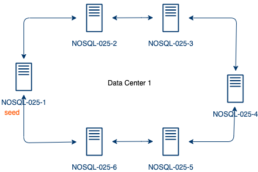

# NoSQL

Máster en Big Data Analytics. Curso 2019/2020


[TOC]

Autores:

- Enrique Puig Nouselles ()

- José Ángel Soler Amo ()
- Andrés Guerrero Doblado (andres@meigal.com)


# Introducción

## Objetivos

El objetivo de estre trabajo es ilustrar las ventajas e inconvenientes de los sistemas de bases de datos relacionales frente a sistemas NoSQL o libres de esquema.


## El problema

La idea de la cual se parte es un problema real. Uno de los miembros del equipo se dedica a la monitorización de infraestructuras TI, y hace uso de una herramienta comercial que almacena información en una base de datos relacional. La aplicación sufre de un problema endémico conocido: hay una penalización bastante alta en el rendimiento de ciertas operaciones cuando el número de items monitorizados aumenta.


A continuación se describen las entidades principales:

- **Monitor**. Define un patrón de monitorización. Ejemplo: Monitorización de espacio para puntos de montaje en sistemas RHEL7.

- **PerformanceRule. **Define un patrón de recolección de datos de rendimiento. Ejemplo: Recolección del porcentaje de CPU utilizado en sistemas Windows 2019.

- **ConfigurationItem (en adelante, CI)**. Representa cada uno de los elementos monitorizados en el sistema. Cada uno de ellos pertenece a una clase diferente y pueden poseer ciertos atributos. Cada CI tiene las siguientes características:

  - Poseen atributos, que son pares de clave-valor que pueden utilizarse para diversas tareas, como agrupar los CIs o crear vistas de usuario.

  - Los CIs pueden instanciar entidades de tipo Monitor y tipo Performance_Rule. 

  - - Las instancias de tipo Monitor proporcionarán un estado de salud y almacenarán los cambios de estado que hayan sufrido a lo largo del tiempo, de modo que podremos no solo consultar el estado de salud de los monitores asociados a un CI, sino también consultar el histórico de cambios de estado.
    - Las instancias de tipo Performance_Rule representan una métrica a tomar de un determinado CI. Cada CI puede instanciar varias Performance_Rule y cada una de estas instancias almacenará el histórico de una métrica de rendimiento determinada, como por ejemplo el espacio ocupado en un disco o la temperatura ambiente en una sala.


Esquema de relacional:


## Autoría del trabajo

### Autores

- Enrique Puig Nouselles ()

- José Ángel Soler Amo ()
- Andrés Guerrero Doblado (andres@meigal.com)

#### Reparto de tareas

- Fase de análisis del problema, implementación de la base de datos relacional, generación de datos y documentación:
  - Todos
- Implementación del sistema NoSQL con Cassandra:
  - Enrique Puig
- Implementación del sistema NoSQL con mongoDB:
  - Andrés Guerrero
- Implementación del sistema NoSQL con Neo4J:
  - José Ángel Soler Amo


# Consultas


Listado de alertas en estado New:

 - Nombre de alerta
 - Severidad
 - CI
 - Fecha
   

Cambios de estado para un monitor en un servidor:

- CI
- Nombre de monitor
- Estado
- Fecha
  

Obtener datos de regla de rendimiento para un servidor:

- CI name
- Regla
- Fecha
- Valor


# Implementaciones

## Cassandra

### Infraestructura del cluster cassandra

La arquitectura utilizada para la implementacion de la practica es la misma que se utilizo durante las clases en el entorno del DSIC con las 6 maquinas virtuales proporcionadas.

- Topologia: Un único datacenter

- Cluster de 6 nodos
  
  - NOSQL-025-1 , NOSQL-025-2, NOSQL-025-3, NOSQL-025-4, NOSQL-025-5 y NOSQL-025-6
- Nodos Seed
  
  - NOSQL-025-1
  
    




En esta arquitectura se ha dejado solamente un nodo seed. Los nodos seed tienen un rol especial dentro del cluster, y es que se encargan de la sincronizacion de los nuevos nodos que entran a formar parte del cluster o incluso de nodos que ya formaban parte pero se han apartado bien por mantenimiento o bien por errores y desincronizacion. Idealmente deberia haber mas de uno, pero para el caso practico que nos atañe con uno será suficiente.

#### Instalacion y configuracion del cluster

Tal y como se ha comentado anteriormente, para la implementacion del modelo en casandra se ha utilizado el cluster que se instalo y configuro en clase. A continuacion se detallan los pasos seguidos:

1. Instalacion de cassandra
2. Conffiguracion cassanda (cassandar.yml) cluster 1 nodo
3.  Despliegue del cluster en el resto de nodos


### Modelo de base de datos

A partir del modelo entidad-relacion del sistema elegido, se ha credo un keyspace en el cluster de cassandra y se ha modelado una solucion para el mismo.

#### Keyspace

sjslkss

#### Modelo

ss


### Carga de datos

En esta fase se ha estudiado los diferentes metodos de carga de datos:

- Generacion de scripts CQL a partir del sistema relacional
- ETL mediante el uso de Python
  - Instalacion dsbulk for JSON: https://docs.datastax.com/en/dsbulk/doc/dsbulk/install/dsbulkInstall.html
  - 

### Consultas

Una vez se han cargado los datos en el modelo de casandra, pasamos a ver como realizar las [consultas](#Consultas) claves del sistema implementado. 

**NOTA**: En el caso de cassandra, el lenguaje de consultas CQL es limitado y solo permite realizar consultas basicas con filtros sencillos. Cualquier tipo de agregacion o acceso a tipos de datos complejos o custom, debe ser realizado a nivel de aplicativo.

- Consulta 1

- Consulta 2

- Consulta 3

  

## MongoDB

### Infraestructura y despliegue del cluster mongo

Comenzamos describiendo la arquitectura del cluster de mongo implementada.

- 3 nodos de réplica:
  - **mongos1n1**, **mongos1n2** y **mongos1n3**
- 3 config servers: 
  - **mongocfg1, mongocfg2 y mongocfg3**
- 2 servidores mongos para rutar las peticiones de clientes:
  - **mongos1 y mongos2**


Aunque en un sistema de producción nunca se deberían instalar todos los servicios en el mismo nodo, con el fin de simplificar la instalación para el propósito de la práctica, se han utilizado contenedores Docker siguiendo la guía referenciada en este sitio web: https://dzone.com/articles/composing-a-sharded-mongodb-on-docker. 


Este es el fichero docker-compose.yaml utilizado:

```yaml
version: '2'
services:
    mongorsn1:
        container_name: mongors1n1
        image: mongo
        command: mongod --shardsvr --replSet mongors1 --dbpath /data/db --port 27017
        ports:
        - 27017:27017
        expose:
        - "27017"
        environment:
            TERM: xterm
        volumes:
        - ~/nosql/source:/source
        - ~/nosql/mongo_cluster/localtime:/etc/localtime:ro
        - ~/nosql/mongo_cluster/data1:/data/db
    mongors1n2:
        container_name: mongors1n2
        image: mongo
        command: mongod --shardsvr --replSet mongors1 --dbpath /data/db --port 27017
        ports:
        - 27027:27017
        expose:
        - "27017"
        environment:
            TERM: xterm
        volumes:  
        - ~/nosql/mongo_cluster/localtime:/etc/localtime:ro
        - ~/nosql/mongo_cluster/data2:/data/db
    mongors1n3:
        container_name: mongors1n3
        image: mongo
        command: mongod --shardsvr --replSet mongors1 --dbpath /data/db --port 27017
        ports:
        - 27037:27017
        expose:
        - "27017"
        environment:
            TERM: xterm
        volumes:
        - ~/nosql/mongo_cluster/localtime:/etc/localtime:ro
        - ~/nosql/mongo_cluster/data3:/data/db
    mongocfg1:
        container_name: mongocfg1
        image: mongo
        command: mongod --configsvr --replSet mongors1conf --dbpath /data/db --port 27017
        environment:
            TERM: xterm
        expose:
            - "27017"
        volumes:
            - ~/nosql/mongo_cluster/localtime:/etc/localtime:ro
            - ~/nosql/mongo_cluster/config1:/data/db
    mongocfg2:
        container_name: mongocfg2
        image: mongo
        command: mongod --configsvr --replSet mongors1conf --dbpath /data/db --port 27017
        environment:
            TERM: xterm
        expose:
            - "27017"
        volumes:
            - ~/nosql/mongo_cluster/localtime:/etc/localtime:ro
            - ~/nosql/mongo_cluster/config2:/data/db
    mongocfg3:
        container_name: mongocfg3
        image: mongo
        command: mongod --configsvr --replSet mongors1conf --dbpath /data/db --port 27017
        environment:
            TERM: xterm
        expose:
            - "27017"
        volumes:
            - ~/nosql/mongo_cluster/localtime:/etc/localtime:ro
            - ~/nosql/mongo_cluster/config3:/data/db
    mongos1:
        container_name: mongos1
        image: mongo
        depends_on:
        - mongocfg1
        - mongocfg2
        command: mongos --configdb mongors1conf/mongocfg1:27017,mongocfg2:27017,mongocfg3:27017 --port 27017
        ports:
        - 27019:27017
        expose:
        - "27017"
        volumes:
        - ~/nosql/mongo_cluster/localtime:/etc/localtime:ro
    mongos2:
        container_name: mongos2
        image: mongo
        depends_on:
        - mongocfg1
        - mongocfg2
        command: mongos --configdb mongors1conf/mongocfg1:27017,mongocfg2:27017,mongocfg3:27017 --port 27017
        ports:
        - 27020:27017
        expose:
        - "27017"
        volumes:
        - ~/nosql/mongo_cluster/localtime:/etc/localtime:ro
```

El fichero de Composer es bastante descriptivo: levantará un docker por cada uno de los nodos descritos previamente haciendo uso de la imagen mongo de Docker y arrancándolos con diferentes parámetros en función de su rol en el cluster.

Con respecto a los volúmenes montados para cada uno merece la pena comentar que:

	- Todos los contenedores montarán en `/etc/localtime` el volumen del host  `~/nosql/mongo_cluster/localtime`. Esa ruta local no es más que un enlace simbólico al fichero `/etc/localtime` de la máquina host. No se ha montado directamente por restricciones de seguridad de Docker en OSX. Por defecto no permite montar la ruta /etc del host. El objetivo de esta configuración, es que todos los contenedores compartan la configuración horaria con entre ellos y con el host.
	- Los contenedores dedicados a replicar la configuración y los shards de datos, almacenarán la información en `/nosql/mongo_cluster/configX` y `/nosql/mongo_cluster/dataX` respectivamente, siendo X el número que identifica al nodo en el set. Los contenedores de los routers no necesitan almacenar ningún tipo de información, ya que simplemente se limitarán a rutar las conexiones de los clientes.
	-  El nodo1 del shard de datos `mongors1n1` monta el volumen del host `~/nosql/source` en `/source` con el fin de tener accesibles los ficheros fuente necesarios para la importación


Tras ejecutar `docker compose up`, podemos comprobar que se han levantado todos los nodos que conforman la arquitectura:

```bash
CONTAINER ID    IMAGE       COMMAND                  CREATED         STATUS          PORTS                      NAMES
082dd7e0e899    mongo       "docker-entrypoint.s…"   37 minutes ago  Up 15 minutes   0.0.0.0:27020->27017/tcp   mongos2
6ce9bec6177d    mongo       "docker-entrypoint.s…"   37 minutes ago  Up 15 minutes   0.0.0.0:27019->27017/tcp   mongos1
1a00b0558347    mongo       "docker-entrypoint.s…"   37 minutes ago  Up 15 minutes   0.0.0.0:27017->27017/tcp   mongors1n1
86b1e7786e9a    mongo       "docker-entrypoint.s…"   37 minutes ago  Up 15 minutes   27017/tcp                  mongocfg2
3d9c7b2ced01    mongo       "docker-entrypoint.s…"   37 minutes ago  Up 15 minutes   0.0.0.0:27037->27017/tcp   mongors1n3
840d45fb27eb    mongo       "docker-entrypoint.s…"   37 minutes ago  Up 15 minutes   27017/tcp                  mongocfg1
f6f2c8c7351a    mongo       "docker-entrypoint.s…"   37 minutes ago  Up 15 minutes   27017/tcp                  mongocfg3
68bd894e1157    mongo       "docker-entrypoint.s…"   37 minutes ago  Up 15 minutes   0.0.0.0:27027->27017/tcp   mongors1n2
```

Inicializamos el set de réplicas de configuración ejecutando el siguiente comando sobre el contenedor mongocfg1 (uno de los servidores de configuración mongo):

```bash
❯ docker exec -it mongocfg1 bash -c "echo 'rs.initiate({_id: \"mongors1conf\",configsvr: true, members: [{ _id : 0, host : \"mongocfg1\" },{ _id : 1, host : \"mongocfg2\" }, { _id : 2, host : \"mongocfg3\" }]})' | mongo"
```

Comprobamos con rs.status() que el replica set de configuración está correctamente inicializado.


Ahora, necesitamos inicializar el shard sobre los nodos mongors1n1, mongors1n2 y mongors1n3.

```bash
❯ docker exec -it mongors1n1 bash -c "echo 'rs.initiate({_id : \"mongors1\", members: [{ _id : 0, host : \"mongors1n1\" },{ _id : 1, host : \"mongors1n2\" },{ _id : 2, host : \"mongors1n3\" }]})' | mongo"
```

Comprobamos con `rs.status()` que el replica set de configuración está correctamente inicializado (en mongocfg1) y repetimos la operación para verificar el shard para datos en mongors1n1.

Podemos comprobar que ya tenemos un shard de nombre **mongors1** y que los tres nodos que hemos configurado pueden verlo:

```bash
❯ docker exec -it mongors1n1 bash -c "echo 'rs.status()' | mongo"
MongoDB shell version v4.2.8
connecting to: mongodb://127.0.0.1:27017/?compressors=disabled&gssapiServiceName=mongodb
Implicit session: session { "id" : UUID("a6b894cc-b029-4645-a007-af20afdec868") }
MongoDB server version: 4.2.8
{
        "set" : "mongors1",
        "date" : ISODate("2020-06-28T10:50:48.423Z"),
        "myState" : 1,
        "term" : NumberLong(1),
        "syncingTo" : "",
        "syncSourceHost" : "",
        "syncSourceId" : -1,
        "heartbeatIntervalMillis" : NumberLong(2000),
        "majorityVoteCount" : 2,
        "writeMajorityCount" : 2,
        "optimes" : {
                "lastCommittedOpTime" : {
                        "ts" : Timestamp(1593341442, 1),
                        "t" : NumberLong(1)
                },
                "lastCommittedWallTime" : ISODate("2020-06-28T10:50:42.702Z"),
                "readConcernMajorityOpTime" : {
                        "ts" : Timestamp(1593341442, 1),
                        "t" : NumberLong(1)
                },
                "readConcernMajorityWallTime" : ISODate("2020-06-28T10:50:42.702Z"),
                "appliedOpTime" : {
                        "ts" : Timestamp(1593341442, 1),
                        "t" : NumberLong(1)
                },
                "durableOpTime" : {
                        "ts" : Timestamp(1593341442, 1),
                        "t" : NumberLong(1)
                },
                "lastAppliedWallTime" : ISODate("2020-06-28T10:50:42.702Z"),
                "lastDurableWallTime" : ISODate("2020-06-28T10:50:42.702Z")
        },
        "lastStableRecoveryTimestamp" : Timestamp(1593341432, 3),
        "lastStableCheckpointTimestamp" : Timestamp(1593341432, 3),
        "electionCandidateMetrics" : {
                "lastElectionReason" : "electionTimeout",
                "lastElectionDate" : ISODate("2020-06-28T10:50:32.672Z"),
                "electionTerm" : NumberLong(1),
                "lastCommittedOpTimeAtElection" : {
                        "ts" : Timestamp(0, 0),
                        "t" : NumberLong(-1)
                },
                "lastSeenOpTimeAtElection" : {
                        "ts" : Timestamp(1593341421, 1),
                        "t" : NumberLong(-1)
                },
                "numVotesNeeded" : 2,
                "priorityAtElection" : 1,
                "electionTimeoutMillis" : NumberLong(10000),
                "numCatchUpOps" : NumberLong(0),
                "newTermStartDate" : ISODate("2020-06-28T10:50:32.701Z"),
                "wMajorityWriteAvailabilityDate" : ISODate("2020-06-28T10:50:33.186Z")
        },
        "members" : [
                {
                        "_id" : 0,
                        "name" : "mongors1n1:27017",
                        "health" : 1,
                        "state" : 1,
                        "stateStr" : "PRIMARY",
                        "uptime" : 71,
                        "optime" : {
                                "ts" : Timestamp(1593341442, 1),
                                "t" : NumberLong(1)
                        },
                        "optimeDate" : ISODate("2020-06-28T10:50:42Z"),
                        "syncingTo" : "",
                        "syncSourceHost" : "",
                        "syncSourceId" : -1,
                        "infoMessage" : "could not find member to sync from",
                        "electionTime" : Timestamp(1593341432, 1),
                        "electionDate" : ISODate("2020-06-28T10:50:32Z"),
                        "configVersion" : 1,
                        "self" : true,
                        "lastHeartbeatMessage" : ""
                },
                {
                        "_id" : 1,
                        "name" : "mongors1n2:27017",
                        "health" : 1,
                        "state" : 2,
                        "stateStr" : "SECONDARY",
                        "uptime" : 27,
                        "optime" : {
                                "ts" : Timestamp(1593341442, 1),
                                "t" : NumberLong(1)
                        },
                        "optimeDurable" : {
                                "ts" : Timestamp(1593341442, 1),
                                "t" : NumberLong(1)
                        },
                        "optimeDate" : ISODate("2020-06-28T10:50:42Z"),
                        "optimeDurableDate" : ISODate("2020-06-28T10:50:42Z"),
                        "lastHeartbeat" : ISODate("2020-06-28T10:50:46.686Z"),
                        "lastHeartbeatRecv" : ISODate("2020-06-28T10:50:47.223Z"),
                        "pingMs" : NumberLong(0),
                        "lastHeartbeatMessage" : "",
                        "syncingTo" : "mongors1n1:27017",
                        "syncSourceHost" : "mongors1n1:27017",
                        "syncSourceId" : 0,
                        "infoMessage" : "",
                        "configVersion" : 1
                },
                {
                        "_id" : 2,
                        "name" : "mongors1n3:27017",
                        "health" : 1,
                        "state" : 2,
                        "stateStr" : "SECONDARY",
                        "uptime" : 27,
                        "optime" : {
                                "ts" : Timestamp(1593341442, 1),
                                "t" : NumberLong(1)
                        },
                        "optimeDurable" : {
                                "ts" : Timestamp(1593341442, 1),
                                "t" : NumberLong(1)
                        },
                        "optimeDate" : ISODate("2020-06-28T10:50:42Z"),
                        "optimeDurableDate" : ISODate("2020-06-28T10:50:42Z"),
                        "lastHeartbeat" : ISODate("2020-06-28T10:50:46.686Z"),
                        "lastHeartbeatRecv" : ISODate("2020-06-28T10:50:47.223Z"),
                        "pingMs" : NumberLong(0),
                        "lastHeartbeatMessage" : "",
                        "syncingTo" : "mongors1n1:27017",
                        "syncSourceHost" : "mongors1n1:27017",
                        "syncSourceId" : 0,
                        "infoMessage" : "",
                        "configVersion" : 1
                }
        ],
        "ok" : 1,
        "$clusterTime" : {
                "clusterTime" : Timestamp(1593341442, 1),
                "signature" : {
                        "hash" : BinData(0,"AAAAAAAAAAAAAAAAAAAAAAAAAAA="),
                        "keyId" : NumberLong(0)
                }
        },
        "operationTime" : Timestamp(1593341442, 1)
}
bye
```

Ya podemos mostrar el shard mongors1 a los routers:

```bash
❯ docker exec -it mongos1 bash -c "echo 'sh.addShard(\"mongors1/mongors1n1\")' | mongo "
MongoDB shell version v4.2.8
connecting to: mongodb://127.0.0.1:27017/?compressors=disabled&gssapiServiceName=mongodb
Implicit session: session { "id" : UUID("d9025c60-eba3-4d3d-929a-e666794be22f") }
MongoDB server version: 4.2.8
{
        "shardAdded" : "mongors1",
        "ok" : 1,
        "operationTime" : Timestamp(1593341557, 7),
        "$clusterTime" : {
                "clusterTime" : Timestamp(1593341557, 7),
                "signature" : {
                        "hash" : BinData(0,"AAAAAAAAAAAAAAAAAAAAAAAAAAA="),
                        "keyId" : NumberLong(0)
                }
        }
}
bye
```

Ahora ya podemos proceder a la creación de nuestra base de datos, que llamaremos `sysmonitor`. Tras la creación habilitaremos el shardening:

```bash
❯ docker exec -it mongors1n1 bash -c "echo 'use sysmonitor' | mongo" 
❯ docker exec -it mongos1 bash -c "echo 'sh.enableSharding(\"sysmonitor\")' | mongo "
```


Comprobamos que todo ha funcionado como esperábamos. Efectivamente vemos el shard mongors1 desde uno de los routers, y también ambas bases de datos, la de configuración y la que acabamos de crear, aunque aún no tenemos shard key definida.

```bash
❯ docker exec -it mongos1 bash -c "echo 'sh.status()' | mongo"                       
MongoDB shell version v4.2.8
connecting to: mongodb://127.0.0.1:27017/?compressors=disabled&gssapiServiceName=mongodb
Implicit session: session { "id" : UUID("65bdb589-bbda-43cf-a30c-6c654716242c") }
MongoDB server version: 4.2.8
--- Sharding Status --- 
  sharding version: {
        "_id" : 1,
        "minCompatibleVersion" : 5,
        "currentVersion" : 6,
        "clusterId" : ObjectId("5ef875eac5e6ff49bccb2a3f")
  }
  shards:
        {  "_id" : "mongors1",  "host" : "mongors1/mongors1n1:27017,mongors1n2:27017,mongors1n3:27017",  "state" : 1 }
  active mongoses:
        "4.2.8" : 2
  autosplit:
        Currently enabled: yes
  balancer:
        Currently enabled:  yes
        Currently running:  no
        Failed balancer rounds in last 5 attempts:  0
        Migration Results for the last 24 hours: 
                No recent migrations
  databases:
        {  "_id" : "config",  "primary" : "config",  "partitioned" : true }
                config.system.sessions
                        shard key: { "_id" : 1 }
                        unique: false
                        balancing: true
                        chunks:
                                mongors1        1024
                        too many chunks to print, use verbose if you want to force print
        {  "_id" : "sysmonitor",  "primary" : "mongors1",  "partitioned" : true,  "version" : {  "uuid" : UUID("71365c44-3606-4b6f-8c16-de20e49217ab"),  "lastMod" : 1 } }

bye
```


**Arranque y parada del servicio:**

Start mongo cluster:

```bash
❯ docker start mongos2 mongos1 mongors1n1 mongocfg2 mongors1n3 mongocfg1 mongocfg3 mongors1n2
```

Stop mongo cluster:

```bash
❯ docker start mongos2 mongos1 mongors1n1 mongocfg2 mongors1n3 mongocfg1 mongocfg3 mongors1n2
```

<u>Borrar TODO el cluster de mongo</u>:

```bash
❯ docker rm mongos2 mongos1 mongors1n1 mongocfg2 mongors1n3 mongocfg1 mongocfg3 mongors1n2
```


#### Organización de la información

#### Agregación e importación de datos

Con el fin de importar los datos en mongo, se comienza exportando cada una de las tablas de la base de datos relacional en formato json. Puesto que las relaciones definidas en la base de datos relacional son todas uno a muchos, existe una tabla por cada una de las entidades definidas en el esquema.


Comenzaremos agregando la tabla **Configuration_Item**, y la tabla **Attributes**:

```bash
❯ head Configuration_Item.json  
[
  {
    "ci_id": 1,
    "name": "impossiblejamb.local"
  },
  {
    "ci_id": 2,
    "name": "rubberyclock.local"
  },
  {

❯ head Attributes.json 
[
  {
    "att_name": "ip_address",
    "att_value": "97.206.53.89",
    "ci_id": 1
  },
  {
    "att_name": "ip_address",
    "att_value": "244.218.216.63",
    "ci_id": 2
```

Con el siguiente script en Python, se cargan ambos ficheros json y se genera un csv con los datos agregados:

```python
import pandas as pd
import json
import numpy as np    

# Load basic CI relational data
ci_df = pd.read_json("../sql/Configuration_Item.json")
attributes_df = pd.read_json("../sql/Attribute.json")

# Load performance relational data
rules_df = pd.read_json("../sql/perfRules.json")
rule_instances_df = pd.read_json("../sql/perfRuleInstances.json")
perf_data_df = pd.read_json("../sql/perfRuleData.json")

# Load monitors relational data
monitors_df = pd.read_json("../sql/Monitors.json")
monitor_instances_df = pd.read_json("../sql/MonitorInstances.json")
monitor_instance_states_df=pd.read_json("../sql/MonitorInstanceStates.json")
health_states_df=pd.read_json("../sql/HealthStates.json").set_index('state_id')


# Merge CI and attributes data into one dataframe
ci_att_df = pd.merge(ci_df,attributes_df,on="ci_id")
cp=ci_att_df.pivot(index="name", columns="att_name")
cp.columns = ['ci_id','ci_id2','ci_id3','device_type','env','ip_address']
cp.drop(columns=['ci_id2', 'ci_id3'], inplace=True)
configuration_items=cp.reset_index()
monitor_instances_df = pd.merge(monitor_instances_df,monitors_df,on="monitor_id")


# Merge performance dataframes
rule_instances_df.rename(columns={'per_ruleId':'ruleId'}, inplace=True)
rule_instances_df = pd.merge(ci_df,rule_instances_df,on="ci_id")
rule_instances = pd.merge(rule_instances_df,rules_df,on="ruleId")
rule_instances.sort_values('ci_id')

documents = []

for ci_index, configuration_item in configuration_items.iterrows():
    ci = json.loads(configuration_item.to_json())
    
    # Attach performance rules instances
    ci["performance_rules"]=[]
    for rule_index, rule_instance in rule_instances[rule_instances["ci_id"]==ci["ci_id"]].loc[:,'ruleId':'rule_description'].iterrows():
        rule = json.loads(rule_instance.to_json())
        
        # Attach performance data 
        data = []
        for perf_data_index, perf_data in perf_data_df[perf_data_df["perf_rule_instId"]==rule["ruleId"]].loc[:,'value':'date'].iterrows():
            d = json.loads(perf_data.to_json())
            data.append(d)
        rule["data"]=data
        ci["performance_rules"].append(rule)
        
    # Attach monitor instances
    ci["monitors"]= []
    
    for monitor_index, monitor_instance in monitor_instances_df[monitor_instances_df["ci_id"]==ci["ci_id"]].loc[:,['mon_isntance_id','name','description']].iterrows():
        monitor = json.loads(monitor_instance.to_json())
        
        # Attach health state for each monitor instance
        states = []
        
        for monitor_instance_index, monitor_instance_state in monitor_instance_states_df[monitor_instance_states_df["mon_isntance_id"]==monitor["mon_isntance_id"]].loc[:,['state_change_date','health_State_id']].iterrows():
            state_id=int(monitor_instance_state["health_State_id"])-1
            monitor_instance_state["health_State_id"] = health_states_df.iloc[state_id].state_name
            currentState = json.loads(monitor_instance_state.to_json())
            states.append(currentState)
        
        monitor["states"]=states
        
        ci["monitors"].append(monitor)
    
    documents.append(ci)
with open('../nosql/cis.json', 'w') as fout:
    fout.write(json.dumps(documents, indent=4))

```

El fichero resultante contendrá un array json con un documento por cada Configuration_Item. A continuación se muestra el ejemplo de un CI. Se han reducido los datos de rendimiento para minimizar la salida.

```json
{
        "name": "austeredear.local",
        "ci_id": 17,
        "device_type": "server",
        "env": "dev",
        "ip_address": "185.206.227.93",
        "performance_rules": [
            {
                "ruleId": 23,
                "rule_name": "% Processor usage",
                "rule_description": "% Processor usage",
                "data": [
                    {
                        "value": 21,
                        "date": 1590192000000
                    },
                    {
                        "value": 25,
                        "date": 1590192300000
                    },
                    {
                        "value": 21,
                        "date": 1590281700000
                    }
                ]
            }
        ],
        "monitors": [
            {
                "mon_isntance_id": 17,
                "name": "Heartbeat Monitor",
                "description": "This monitor checks if the device is up",
                "states": [
                    {
                        "state_change_date": "2020-05-17T03:24:00",
                        "health_State_id": "Healthy"
                    },
                    {
                        "state_change_date": "2020-05-23T03:44:04",
                        "health_State_id": "Critical"
                    },
                    {
                        "state_change_date": "2020-05-23T04:15:59",
                        "health_State_id": "Healthy"
                    }
                ]
            },
            {
                "mon_isntance_id": 251,
                "name": "Process Ssh",
                "description": "This process monitor watches for the Ssh Daemon process to be running.",
                "states": [
                    {
                        "state_change_date": "2020-05-17T15:25:00",
                        "health_State_id": "Healthy"
                    }
                ]
            },
            {
                "mon_isntance_id": 252,
                "name": "Operating System Available MBytes",
                "description": "Available megabytes of memory is low. System performance may be adversely affected.  The available megabytes memory value represents the sum of MemFree, Buffers and Cached as reported by the operating system.",
                "states": [
                    {
                        "state_change_date": "2020-05-17T02:51:00",
                        "health_State_id": "Healthy"
                    }
                ]
            }
        ]
    }
```


Como puede observarse en el fichero de definición de Docker Compose, en el primer nodo de las réplicas hemos exportado un directorio (`/source`) de la máquina host donde se han guardado los ficheros csv generados. Ejecutamos `mongoimport` para importar los documentos del json generado en la colección `configuration_item` :

```bash
❯ docker exec -it mongors1n1 bash -c "mongoimport -d sysmonitor -c configuration_item --jsonArray --type=json /source/cis.json"
2020-06-28T21:24:19.481+0200    connected to: mongodb://localhost/
2020-06-28T21:24:19.615+0200    100 document(s) imported successfully. 0 document(s) failed to import.

```

Comprobamos con un simple `find()` que los documentos se han cargado correctamente. A continuación se muestran tan sólo algunos atributos del CI de nombre ``productivetrue.local``

```bash
❯ docker exec -it mongos1 bash -c "echo -e 'use sysmonitor \n db.configuration_item.find({ \"name\":\"productivetrue.local\"}, { name: 1, ip_address: 1, env: 1 } ).pretty()' | mongo"             
MongoDB shell version v4.2.8
connecting to: mongodb://127.0.0.1:27017/?compressors=disabled&gssapiServiceName=mongodb
Implicit session: session { "id" : UUID("f1632408-b566-4d1f-a491-84b73c8f4344") }
MongoDB server version: 4.2.8
switched to db sysmonitor
{
        "_id" : ObjectId("5ef8ee639f3bb1c5cbbbbe77"),
        "name" : "productivetrue.local",
        "env" : "dev",
        "ip_address" : "6.2.24.168"
}
bye
```


```
docker exec -it mongors1n1 bash -c "echo 'use sysmonitor' | mongo"

docker exec -it mongos1 bash -c "echo 'sh.enableSharding(\"sysmonitor\")' | mongo "
docker exec -it mongors1n1 bash -c "echo 'db.createCollection(\"sysmonitor.configurationItem\")' | mongo "
docker exec -it mongos1 bash -c "echo 'sh.shardCollection(\"sysmonitor.configurationItem\", {\"shardingField\" : 1})' | mongo "

```


# 


# Implementación en NEO4J

<!--INTRO DE LOS PASOS QUE SE VAN A REALIZAR Y LA MÁQUINA QUE SE VA A USAR-->

### Aproximación de BDR a BDG

En primer lugar, como la base de datos de grafos (BDG) es creada a partir de una base de datos relacional, se recuerda que la base de datos relacional (BDR) es la siguiente:

<!--IMAGEN-->

Si se analiza con detenimiento el esquema relacional, se observa que no hay tablas de unión, por lo que cada tabla de la base de datos relacional puede corresponderse con una tabla en la base de datos de grafos.

En la BDR, se observa que existen tablas que asocian un ID con una descripción, como por ejemplo Alert_State o Health_State. Se puede plantear una reducción, de forma que en los nodos del grafo se informen directamente los nombres en vez de un ID asociado a otra tabla. En el caso de grafos, esta reducción es interesante ya que las consultas se realizan sobre caminos (paths), y lo más común es que mediante un único camino no se pueda obtener tal descripción, sobre todo en queries complejas. Sin embargo, en este proyecto no se realizará tal simplificación, de cara a que sea más enriquecedor.

Una vez decidido que cada tabla se corresponde con un nodo y que las relaciones entre nodos se corresponden con las relaciones entre tablas, se procede a crear la base de datos de grafos.

### Creación de la base de datos de grafos

Como primer paso, en la carpeta `./neo4j-community-3.3.0/data/database/` se añade una carpeta con el nombre de la base de datos, en este caso **sysmonitor.db**:

`mkdir /root/neo4j-community-3.3.0/data/databases/sysmonitor.db`

Una vez creada la carpeta, se edita el fichero `/root/neo4j-community-3.3.0/conf/neo4j.conf` y se realiza el siguiente cambio:

`dbms.active_database=sysmonitor.db`

Tras esto, se inicia NEO4J:

`./neo4j-community-3.3.0/bin/neo4j start`

Una vez iniciado, se puede observar que la base de datos activa se corresponde con la que acabamos de crear:

<!--`IMAGEN BASE DE DATOS`-->

### Creación de los nodos de la BDG

Como el modelo se ha creado a partir de una BDR, se descargan los datos correspondientes a las tablas en formato CSV, de cara a importarlos a NEO4J. Tras esto, en la carpeta `./neo4j-community-3.3.0/import` se crea una carpeta llamada `datosSysmonitor`, donde se guardan todos los archivos CSV que contienen la información de tablas de la BDR.

Una vez se puede acceder a la información del modelo relacional, se procede a crear todos los nodos:

*Configuration item*: El nodo se llama **Conf_Item**, y se crea de la siguiente forma:

`LOAD CSV WITH HEADERS FROM "file:///datosSysmonitor/ConfigurationItem.csv" AS row CREATE (n:Conf_Item)` 
`SET` 
`n.ci_id = toInteger(row.ci_id),`
`n.name = row.name;`

Como la lectura de un archivo CSV en NEO4J considera todos los campos como caracteres, en caso de que el campo no sea un caracter ha de indicarse, como ocurre con los IDs.

*Configuration item attributes:* El nodo se llama **CI_Attributes**, y se genera como sigue:

`LOAD CSV WITH HEADERS FROM "file:///datosSysmonitor/ci_Attributes.csv" AS row CREATE (n:CI_Attributes)` 
`SET` 
`n.ci_id = toInteger(row.ci_id),`
`n.att_name = row.att_name,`
`n.att_value = row.att_value;`

*Performance rule*: El nodo se llama **Performance_Rule**, y se crea mediante el siguiente comando:

`LOAD CSV WITH HEADERS FROM "file:///datosSysmonitor/Performance_Rule.csv" AS row CREATE (n:Performance_Rule)` 
`SET` 
`n.ruleId = toInteger(row.ruleId),`
`n.rule_name = row.rule_name,`
`n.rule_description = row.rule_description;`

*Performance rule instance*: El nodo se llama **Perf_Rule_Instance**, y se genera mediante:

`LOAD CSV WITH HEADERS FROM "file:///datosSysmonitor/Performance_Rule_Instance.csv" AS row CREATE (n:Perf_Rule_Instance)` 
`SET` 
`n.ci_id = toInteger(row.ci_id),`
`n.per_ruleId = toInteger(row.per_ruleId),`
`n.instance_id = toInteger(row.instance_id);`

*Performance rule data*: El nodo se llama **Perf_Rule_Data**, y se crea como sigue:

`LOAD CSV WITH HEADERS FROM "file:///datosSysmonitor/Perf_Rule_Data.csv" AS row CREATE (n:Perf_Rule_Data)` 
`SET` 
`n.date = row.date,`
`n.perf_rule_instId = toInteger(row.perf_rule_instId),`
`n.rule_data_id = toInteger(row.rule_data_id),`
`n.value = toInteger(row.value);`

*Monitor:* El nodo también se llama **Monitor,** y es creado mediante la siguiente ejecución:

`LOAD CSV WITH HEADERS FROM "file:///datosSysmonitor/Monitor.csv" AS row CREATE (n:Monitor)` 
`SET` 
`n.name = row.name,`
`n.description = row.description,`
`n.monitor_id = toInteger(row.monitor_id),`
`n.alert_description = row.alert_description,`
`n.alert_name = row.alert_name;`

*Monitor parameters*: El nodo se llama **Monitor_Parameter**, y se genera mediante:

`LOAD CSV WITH HEADERS FROM "file:///datosSysmonitor/Monitor_Parameter.csv" AS row CREATE (n:Monitor_Parameter)` 
`SET` 
`n.name = row.name,`
`n.monitor_id = toInteger(row.monitor_id),`
`n.value = toInteger(row.value),`
`n.param_id = toInteger(row.param_id);`

*Monitor instance*: El nodo se llama **Monitor_Instance**, y se crea mediante:

`LOAD CSV WITH HEADERS FROM "file:///datosSysmonitor/Monitor_Instance.csv" AS row CREATE (n:Monitor_Instance)` 
`SET`
`n.ci_id = toInteger(row.ci_id),`
`n.monitor_id = toInteger(row.monitor_id),`
`n.mon_isntance_id = toInteger(row.mon_isntance_id);`

*Monitor instance state:* El nodo se llama **Monitor_Instance_State**, y se crea utilizando el siguiente comando:

`LOAD CSV WITH HEADERS FROM "file:///datosSysmonitor/Monitor_Instance_State.csv" AS row CREATE (n:Monitor_Instance_State)` 
`SET` 
`n.monitor_instance_state_id = toInteger(row.monitor_instance_state_id),`
`n.state_change_date = row.state_change_date,`
`n.mon_isntance_id = toInteger(row.mon_isntance_id),`
`n.health_State_id = toInteger(row.health_State_id);`

*Health state*: El nodo se llama **Health_State**, y se genera mediante:

`LOAD CSV WITH HEADERS FROM "file:///datosSysmonitor/Health_State.csv" AS row CREATE (n:Health_State)` 
`SET` 
`n.state_name = row.state_name,`
`n.state_id = toInteger(row.state_id);`

*Alert instance*: El nodo se llama **Alert_Instance**, y se produce mediante:

`LOAD CSV WITH HEADERS FROM "file:///datosSysmonitor/Alert_Instance.csv" AS row CREATE (n:Alert_Instance)` 
`SET` 
`n.severity = toInteger(row.severity),`
`n.alert_State_id = toInteger(row.alert_State_id),`
`n.state_change_date = row.state_change_date,`
`n.priority = toInteger(row.priority),`
`n.mon_isntance_id = toInteger(row.mon_isntance_id),`
`n.alert_instance_id = toInteger(row.alert_instance_id);`

*Alert state*: El nodo se llama **Alert_State**, y se origina mediante el siguiente código:

`LOAD CSV WITH HEADERS FROM "file:///datosSysmonitor/Alert_State.csv" AS row CREATE (n:Alert_State)` 
`SET` 
`n.state_name = row.state_name,`
`n.state_id = toInteger(row.state_id);`

Tras aplicar estos comandos, se han generado todos los nodos de la base de datos con sus respectivas propiedades.

### Creación de relaciones entre nodos

De cara a crear las relaciones entre nodos, se utilizan los mismos campos del esquema relacional, de forma que si coinciden las claves principal y foránea, se crea una relación entre los dos nodos. Lo primero que se puede observar en el esquema relacional es que todas las relaciones son 1:n. De cara a crear las relaciones entre nodos, se toman los datos del nodo asociados al cardinal n, y en caso de coincidir las claves se genera la relación.

Por ejemplo, si se pretende crear la relación entre **Conf_Item** y sus atributos (**CI_Attributes**), se toman todos los datos de CI_Attributes, y se genera una relación en caso de que el campo **ci_id** coincida en ambos nodos.

Por tanto, la creación de todas las relaciones ha sido de la siguiente forma:

*RULE_EXECUTED_IN:* Relaciona los nodos **Performance_Rule** y **Perf_Rule_Instance**:

`LOAD CSV WITH HEADERS FROM "file:///datosSysmonitor/Performance_Rule_Instance.csv" AS row`
`MATCH (perfRule:Performance_Rule {ruleId: toInteger(row.per_ruleId)})`
`MATCH (perfRuleInst:Perf_Rule_Instance {per_ruleId: toInteger(row.per_ruleId)})`
`MERGE (perfRule)-[:RULE_EXECUTED_IN]->(perfRuleInst);`

*RULE_INS_CHANGE_LOG*: Relaciona los nodos **Perf_Rule_Instance** y **Perf_Rule_Data**:

`LOAD CSV WITH HEADERS FROM "file:///datosSysmonitor/Perf_Rule_Data.csv" AS row`
`MATCH (perfRuleInst:Perf_Rule_Instance {instance_id: toInteger(row.perf_rule_instId)})`
`MATCH (perfRuleData:Perf_Rule_Data {perf_rule_instId: toInteger(row.perf_rule_instId)})`
`MERGE (perfRuleInst)-[:RULE_INS_CHANGE_LOG]->(perfRuleData);`

*CI_MEASURED_BY*: Relaciona los nodos **Conf_Item** y **Perf_Rule_Instance**:

`LOAD CSV WITH HEADERS FROM "file:///datosSysmonitor/Performance_Rule_Instance.csv" AS row`
`MATCH (confItem:Conf_Item {ci_id: toInteger(row.ci_id)})`
`MATCH (perfRuleInst:Perf_Rule_Instance {ci_id: toInteger(row.ci_id)})`
`MERGE (confItem)-[:CI_MEASURED_BY]->(perfRuleInst);`

*CI_CONTAINS*: Relaciona los nodos **Conf_Item** y **CI_Attributes**:

`LOAD CSV WITH HEADERS FROM "file:///datosSysmonitor/ci_Attributes.csv" AS row`
`MATCH (confItem:Conf_Item {ci_id: toInteger(row.ci_id)})`
`MATCH (ciAttrib:CI_Attributes {ci_id: toInteger(row.ci_id)})`
`MERGE (confItem)-[:CI_CONTAINS]->(ciAttrib);`

*MONITOR_CONTAINS*: Relaciona los nodos **Monitor** y **Monitor_Parameter**:

`LOAD CSV WITH HEADERS FROM "file:///datosSysmonitor/Monitor_Parameter.csv" AS row`
`MATCH (Monitor:Monitor {monitor_id: toInteger(row.monitor_id)})`
`MATCH (monitorParam:Monitor_Parameter {monitor_id: toInteger(row.monitor_id)})`
`MERGE (Monitor)-[:MONITOR_CONTAINS]->(monitorParam);`

*CI_MONITORED_BY*: Relaciona los nodos **Conf_Item** y **Monitor_Instance**:

`LOAD CSV WITH HEADERS FROM "file:///datosSysmonitor/Monitor_Instance.csv" AS row`
`MATCH (confItem:Conf_Item {ci_id: toInteger(row.ci_id)})`
`MATCH (monitorInstance:Monitor_Instance {ci_id: toInteger(row.ci_id)})`
`MERGE (confItem)-[:CI_MONITORED_BY]->(monitorInstance);`

*MONITOR_INSTANTIATED_BY:* Relaciona los nodos **Monitor** y **Monitor_Instance**:

`LOAD CSV WITH HEADERS FROM "file:///datosSysmonitor/Monitor_Instance.csv" AS row`
`MATCH (monitor:Monitor {monitor_id: toInteger(row.monitor_id)})`
`MATCH (monitorInstance:Monitor_Instance {monitor_id: toInteger(row.monitor_id)})`
`MERGE (monitor)-[:MONITOR_INSTANTIATED_BY]->(monitorInstance);`

*WITH_ALERT*: Relaciona los nodos **Monitor_Instance** y **Alert_Instance**:

`LOAD CSV WITH HEADERS FROM "file:///datosSysmonitor/Alert_Instance.csv" AS row`
`MATCH (monitorInstance:Monitor_Instance {mon_isntance_id: toInteger(row.mon_isntance_id)})`
`MATCH (alertInstance:Alert_Instance {mon_isntance_id: toInteger(row.mon_isntance_id)})`
`MERGE (monitorInstance)-[:WITH_ALERT]->(alertInstance);`

*WITH_ALERT_STATE:* Relaciona los nodos **Alert_State** y **Alert_Instance**:

`LOAD CSV WITH HEADERS FROM "file:///datosSysmonitor/Alert_Instance.csv" AS row`
`MATCH (alertState:Alert_State {state_id: toInteger(row.alert_State_id)})`
`MATCH (alertInstance:Alert_Instance {alert_State_id: toInteger(row.alert_State_id)})`
`MERGE (alertState)-[:WITH_ALERT_STATE]->(alertInstance);`

*WITH_STATE*: Relaciona los nodos **Monitor_Instance** y **Monitor_Instance_State:**

`LOAD CSV WITH HEADERS FROM "file:///datosSysmonitor/Monitor_Instance_State.csv" AS row`
`MATCH (monitorInstance:Monitor_Instance {mon_isntance_id: toInteger(row.mon_isntance_id)})`
`MATCH (monInstanceState:Monitor_Instance_State {mon_isntance_id: toInteger(row.mon_isntance_id)})`
`MERGE (monitorInstance)-[:WITH_STATE]->(monInstanceState);`

*WITH_HEALTH_STATE*: Relaciona los nodos **Health_State** y **Monitor_Instance_State:**

`LOAD CSV WITH HEADERS FROM "file:///datosSysmonitor/Monitor_Instance_State.csv" AS row`
`MATCH (healthState:Health_State {state_id: toInteger(row.health_State_id)})`
`MATCH (monInstanceState:Monitor_Instance_State {health_State_id: toInteger(row.health_State_id)})`
`MERGE (healthState)-[:WITH_HEALTH_STATE]->(monInstanceState);`

Tras generar todas las relaciones entre nodos, la base de datos se puede visualizar utilizando el comando `call db.schema`, y al ejecutarlo se observa el siguiente diagrama:

<!--IMAGEN DEL DIAGRAMA DE GRAFOS--> 

### Creación de restricciones

En caso de no añadir nada más al modelo, nada impide que existan dos nodos diferentes con exactamente las mismas propiedades. Para evitar duplicados cuando sea necesario, se han de añadir restricciones en la creación de nuevos nodos. Los nodos que han de tener la restricción de unicidad son:

*Performance_Rule:* La restricción de unicidad se realiza como sigue:

`CREATE CONSTRAINT ON (n:Performance_Rule) ASSERT n.ruleId IS UNIQUE`

*Perf_Rule_Data*: La restricción de unicidad se alcanza mediante:

`CREATE CONSTRAINT ON (n:Perf_Rule_Data) ASSERT n.rule_data_id IS UNIQUE`

*Perf_Rule_Instance:* Se limita la creación de nodos duplicados con el comando:

`CREATE CONSTRAINT ON (n:Perf_Rule_Instance) ASSERT n.instance_id IS UNIQUE`

*Conf_Item:* La restricción de unicidad se realiza con:

`CREATE CONSTRAINT ON (n:Conf_Item) ASSERT n.ci_id IS UNIQUE`

*Monitor:* La unicidad entre nodos se alcanza mediante:

`CREATE CONSTRAINT ON (n:Monitor) ASSERT n.monitor_id IS UNIQUE`

*Monitor_Instance:* La restricción de nodos duplicados se realiza de la forma:

`CREATE CONSTRAINT ON (n:Monitor_Instance) ASSERT n.mon_isntance_id IS UNIQUE`

*Alert_Instance*: Se limita la creación de nodos mediante el siguiente comando:

`CREATE CONSTRAINT ON (n:Alert_Instance) ASSERT n.alert_instance_id IS UNIQUE`

*Alert_State:* La restricción de unicidad se alcanza mediante:

`CREATE CONSTRAINT ON (n:Alert_State) ASSERT n.state_id IS UNIQUE`

Las demás restricciones a crear contienen varios campos a definir como únicos, como es el caso de *Monitor_Parameter*. Para generar una restricción de unicidad con múltiples propiedades, se necesita la versión Enterprise, y tal restricción se realizaría como sigue:

`CREATE CONSTRAINT Monitor_Parameter_Constraint ON (n:Monitor_Parameter) ASSERT (n.monitor_id, n.param_id) IS NODE KEY`

También existe la opción de crear una nueva propiedad mediante la concatenación de las propiedades únicas, y crear la restricción de unicidad en esta nueva propiedad. En nuestro caso, como en los nodos restantes el hecho de tener duplicados no afecta al correcto funcionamiento de la base de datos, no se ha realizado este método.

### Consultas realizadas

Se han realizado distintas consultas para comprobar el correcto funcionamiento de la base de datos. La obtención de datos de las consultas en este apartado se ha comprobado que es correcta realizando esa misma consulta en la BDR.

Las primeras consultas se realizan para comprobar el número de nodos y relaciones:

